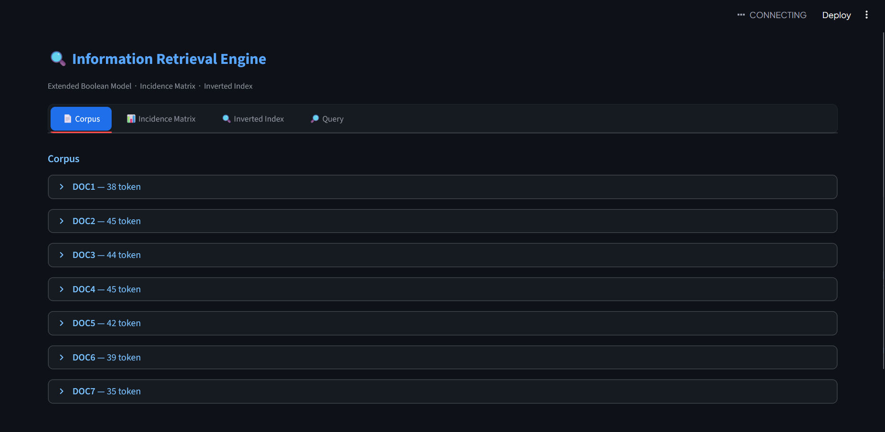
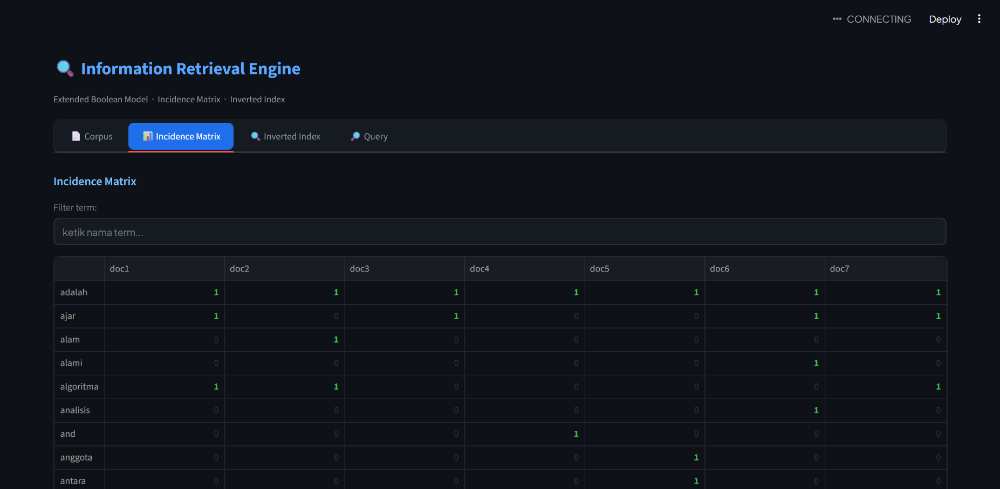
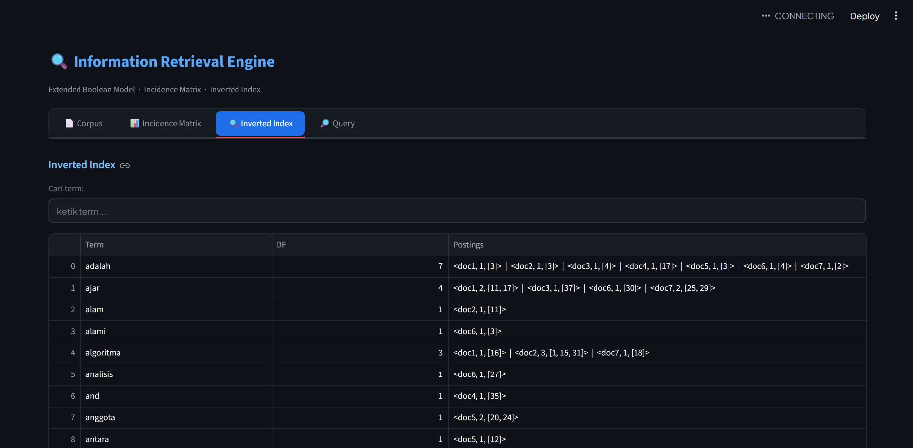
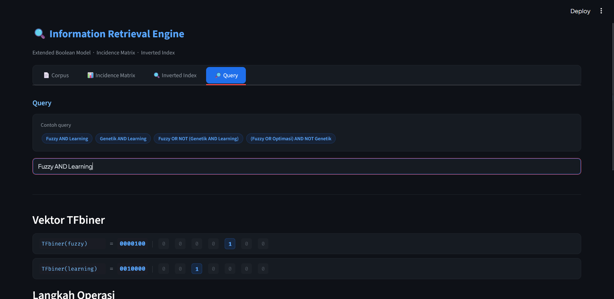
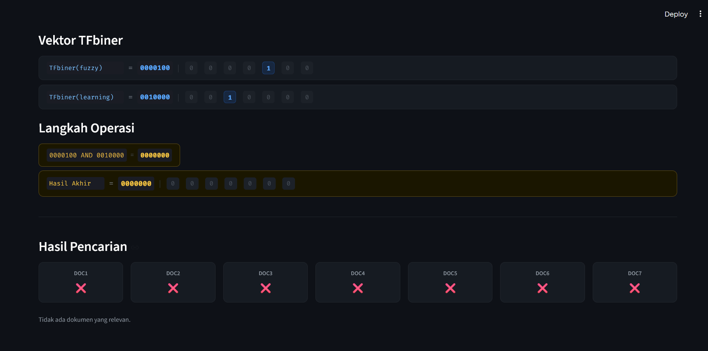

# 📚 Tugas STKI — Boolean Retrieval Model

> **Mata Kuliah:** Sistem Temu Kembali Informasi (STKI)
> **Nama:** I Kadek Bintang Adi Bimantara
> **NIM:** 2405551049

---

## 📄 Deskripsi

Implementasi **Boolean Retrieval Model** dengan teknik **Incidence Matrix** dan **Inverted Index** menggunakan Python dan Streamlit. Program mendukung query boolean dengan operator AND, OR, NOT, serta kurung `()` dengan operator precedence sesuai materi kuliah.

---

## 📸 Tampilan Aplikasi

**1. Tampilan Corpus Dokumen**


**2. Tampilan Incidence Matrix**


**3. Tampilan Inverted Index**


**4. Tampilan Input Query**


**5. Tampilan Hasil Pencarian Query**


---

## 🗂️ Struktur Project

```
Tugas-STKI/
├── app.py               # Antarmuka utama (Streamlit)
├── preprocessing.py     # Tokenisasi & Stemming
├── indexing.py          # Incidence Matrix & Inverted Index
├── ir_model.py          # Boolean Retrieval Model
├── requirements.txt     # Daftar library
├── .gitignore
├── images/              # Screenshot tampilan aplikasi
└── corpus/
    ├── doc1.txt         # Kecerdasan Buatan
    ├── doc2.txt         # Algoritma Genetika
    ├── doc3.txt         # Jaringan Saraf Tiruan
    ├── doc4.txt         # Sistem Temu Kembali Informasi
    ├── doc5.txt         # Logika Fuzzy
    ├── doc6.txt         # Pemrosesan Bahasa Alami
    └── doc7.txt         # Robotika Cerdas
```

---

## ⚙️ Pre-Processing

| Tahap | Keterangan |
|---|---|
| Tokenisasi | Memecah teks menjadi token/kata |
| Stemming | Mengubah kata ke bentuk dasar menggunakan **PySastrawi** |
| Stopwords | Tidak digunakan |

---

## 🔍 Fitur

- **Incidence Matrix** — Representasi biner (TFbiner) term × dokumen
- **Inverted Index** — Notasi `<idj, fij, [posisi]>`
- **Boolean Query** — Operator AND, OR, NOT
- **Operator Precedence** — `()` → `NOT` → `AND` → `OR`
- **Langkah Operasi** — Ditampilkan step-by-step seperti materi kuliah

---

## 🚀 Cara Menjalankan

**1. Install library**
```bash
pip install streamlit pandas PySastrawi
```

**2. Jalankan aplikasi**
```bash
streamlit run app.py
```

**3. Buka browser**
```
http://localhost:8501
```

---

## 🔎 Contoh Query

```
Fuzzy AND Learning
Genetik AND Learning
Fuzzy OR NOT (Genetik AND Learning)
(Fuzzy OR Optimasi) AND NOT Genetik
```

---

## 🛠️ Teknologi


